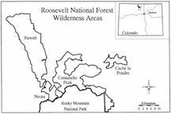

```{r setup, include=FALSE}
knitr::opts_chunk$set(echo = TRUE)
```

``` {r libraries, include=FALSE, display=FALSE}
# load libraries used for the analysis
library(lattice)
library(RColorBrewer)
library(latticeExtra)
library(corrplot)
library(rpart)
library(gridExtra)
library(ascii)
library(rpart.plot)
library(mclust)
library(ggfortify)
library(rgl)
library(mclust)
library(cluster)
library(ROCR)
library(caret)
library(e1071)
```

# 1. Introduction

Having a complete and accurate record of natural resources helps local and national resource management organizations make informed decisions about how to best preserve or utilize specific types of land. In this study, we examine whether predictive models that employ digital spacial data from geographic information system (GIS) can substitute manual field surveys in order to correctly categorize land forest cover type. 

According to Blackard and Dean's original paper on this subject, "generally, forest cover type data is either directly recorded by field personnel or estimated from remotely sensed data"[include citation and reference], which can be time-consuming and expensive work. Our goal is to assess whether this time and cost could be reduced by relying on data available through digital collection, instead.

*[Placeholder for literature review section about types of models used in our project.]*

# 2. The Modeling Problem

Our aim is to build a multiclass calssification model that can predict the forest cover type for a 30 x 30 meter parcel of land. To do so, we will use data obtained from the US Forest Service (USFS) Region 2 Resource Information System (RIS) which contains measured attributes for over half a million parcels of land. These attributes include wilderness area type, soil type, the parcel's orientation to water, roadways, and wildfire-prone areas, and other cartographic features.

# 3. The Data

The data used for our study comes from a 1998 study by Blackard and Dean in which US Forest Service (USFS) Region 2 Resource Information System (RIS) data and US Geological Survey (USGS) were compiled for 581,012 parcels of land. Each parcel corresponds with a 30 x 30 meter area in one of the following four regions of the Roosevelt National Forest in Colorado: Rawah, Neota, Comanche Peak, Cache la Poudre. These regions are mapped out in Figure 1.



For each parcel of land, the 13 variables listed in Table 1 were provided for each 30 x 30 meter land parcel (equivalent to one observation in the dataset). For prediction purposes, Forest Cover Type will be used as the dependent variable, and combinations of some or all of the remaining variables as the predictor variables.

### Table 1: Description of variables

**Variable Description** | **Type & Measurement**
-----------------------------------------------|--------------------------------
Elevation                                      | numeric in meters 
Aspect                                         | numeric in degrees azimuth 
Slope                                          | numeric in degrees
Horizontal distance to nearest surce water features | numeric in meters
Vertical distance to nearest surce water features | numeric in meters
Horizontal distance to nearest roadway         | numeric in meters
Hillshade index at 9am during summer solstice  | numeric as index (0 to 255)
Hillshade index at Noon during summer solstice | numeric as index (0 to 255)
Hillshade index at 3pm during summer solstice  | numeric as index (0 to 255) 
Horizontal distance to nearest wildfire ignition points | numeric in meters
Wilderness Areas (4 areas)                     | binary for each area (0 or 1)
-    *1 - Rawah*                               |
-    *2 - Neota*                               |
-    *3 - Comanche Peak*                       |
-    *4 - Cache la Poudre*                     |
Soil Type  (40 types)                          | binary for each type (0 or 1)
    - *See Appendix A for details*             |
Forest Cover Type  (7 types)                   | integer for each type (0 or 1)
-    *1 - Spruce/Fir*                          |
-    *2 - Lodgepole Pine*                      | 
-    *3 - Ponderosa Pine*                      | 
-    *4 - Cottonwood/Willow*                   | 
-    *5 - Aspen*                               | 
-    *6 - Douglas-fir*                         | 
-    *7 - Krummholz*                           | 

```{r datastep, include=FALSE, results=FALSE}
# load the full dataset
covtype <- read.csv("covtype.data", sep = ",", header = FALSE)
summary(covtype)

# load the variable "key" - this is buggy but I at least can get the variable names quickly
key <- read.delim("forestcover_key.txt") 

# set column names for the main dataframe from key
covtype.names <- row.names(key)
covtype.names.complete <- c() 
for (i in 1:ncol(covtype)) {
    if (i <= 10) {
        covtype.names.complete[i] <- covtype.names[i]
    }
    else if (i > 10 & i <= 14) {
        covtype.names.complete[i] <- paste0("Wilderness_Area",i-10) 
    }
    else if (i > 14 & i <= 54) {
        covtype.names.complete[i] <- paste0("Soil_Type",i-14)
    }
    else if (i == 55) {
        covtype.names.complete[i] <- "Cover_Type"
    }
}
colnames(covtype) <- covtype.names.complete


# assign human-readable names for forest cover types
covtype$Cover_Type <- ifelse(covtype$Cover_Type == 1, "Spruce/Fir",
                             ifelse(covtype$Cover_Type == 2, "Lodgepole Pine",
                                    ifelse(covtype$Cover_Type == 3, "Ponderosa Pine",
                                           ifelse(covtype$Cover_Type == 4, "Cottonwood/Willow",
                                                  ifelse(covtype$Cover_Type == 5, "Aspen",
                                                         ifelse(covtype$Cover_Type == 6, "Douglas-fir",
                                                                ifelse(covtype$Cover_Type == 7, "Krummholz",NA)))))))
# set numerical variables as factors for soil type, wilderness area, and forest cover
covtype[,11:55] <- lapply(covtype[,11:55], factor)
summary(covtype)
```

``` {r trainingtest, include=FALSE, results=FALSE}
# create training, test, and validation sets of data
# set sample size for training, test, and validation
fractionTraining   <- 0.50
fractionValidation <- 0.25
fractionTest       <- 0.25

# compute sample sizes
sampleSizeTraining   <- floor(fractionTraining   * nrow(covtype))
sampleSizeValidation <- floor(fractionValidation * nrow(covtype))
sampleSizeTest       <- floor(fractionTest       * nrow(covtype))

# set the indeces for the training, validation, and sample sets
indicesTraining    <- sort(sample(seq_len(nrow(covtype)), size=sampleSizeTraining))
indicesNotTraining <- setdiff(seq_len(nrow(covtype)), indicesTraining)
indicesValidation  <- sort(sample(indicesNotTraining, size=sampleSizeValidation))
indicesTest        <- setdiff(indicesNotTraining, indicesValidation)

# create the three dataframes for training, validation, and test
covtype.training   <- covtype[indicesTraining, ]
covtype.validation <- covtype[indicesValidation, ]
covtype.test       <- covtype[indicesTest, ]

````

# 4. Exploratory Data Analysis (EDA)

## Traditional EDA

``` {r forestcoverbarplot, include=FALSE, results=TRUE}
# frequency of forest cover types
barchart(covtype$Cover_Type[order(covtype$Cover_Type)], data = covtype, 
         col = "grey", xlab = "Frequency")
```


### Figure 3: Correlation plot of numeric variables

```{r correlations, echo=FALSE, fig.width = 3, fig.height = 2.8, fig.align = "center"}
# correlation plot for numeric variables
corrplot(cor(covtype.training[,1:10]), 
         method = "color", tl.col = "black", tl.cex = 0.5, cl.cex = 0.5)
```


## Model-Based EDA

Model-based exploratory data analysis allows us to glean additional information about the relationships between our predictors and the response variable from naive models applied to the training dataset. In particular, tree-based classification can reveal any possible interaction effects that are not initially apparent from univariate and bivariate exploratory data analysis.

### Tree-based Classification Model


```{r rpartmodel, echo=FALSE, include = FALSE}
treefit <- rpart(Cover_Type ~ ., method = "class", data = covtype.training)
```

```{r rpartsummary, echo=FALSE, include = FALSE}
printcp(treefit) # display the results 
plotcp(treefit) # visualize cross-validation results 
summary(treefit) # detailed summary of splits
predictions <- round(predict(treefit),0)
predictions.vector <- ifelse(predictions[,1] == 1, "Spruce/Fir", 
                             ifelse(predictions[,2] == 1, "Lodgepole Pine", 
                                    ifelse(predictions[,3] == 1, "Ponderosa Pine",
                                           ifelse(predictions[,4] == 1, "Cottonwood/Willow",
                                                  ifelse(predictions[,5] == 1, "Aspen",
                                                         ifelse(predictions[,6] == 1, "Douglas-fir",
                                                                ifelse(predictions[,7] == 1, "Krummholz", NA)))))))
treefitCM <- confusionMatrix(data = predictions.vector, reference = covtype.training$Cover_Type)
treefitCM$overall["Accuracy"]
```

```{r rpartplotvarimpt, echo = FALSE, display = TRUE, fig.height = 3, fig.width = 4, fig.cap = 'Classification Tree Variable Importance Plot', fig.align="center"}
barplot(treefit$variable.importance[order(treefit$variable.importance)], 
        cex.names = 0.5, horiz = TRUE, cex.axis = 0.5, las=1)
```

#### Figure 6: Classification tree 

```{r rpartplot, echo = FALSE, display = TRUE, fig.height = 4.3, fig.aligh = "center"}
rpart.plot(treefit, uniform=TRUE, extra=104, main="", cex = 0.7)
```
  

## K-means Clustering Placeholder

```{r kmeans, echo=FALSE, include = FALSE}
#comp <- data.frame(pcafit$x[,1:6])
#kmeansfit1 <- kmeans(wine.norm[,2:14], 3)
#kmeansfit2 <- kmeans(comp[,1:6], 3)
```


\pagebreak

# Next Steps for our Paper

* Reach final agreement on sampling approach (i.e. sample randomly across the full dataset vs. sample randomly within each forest cover type category)
* Begin building models using Neural Networks and SVMs
* Figure out how to properly do citations in R Markdown
* Continue refining introduction to align with results from the modeling process
* Begin writing for additional sections of the paper

\pagebreak

# 5. Predictive Modeling: Methods and Results

## Train / Test Data

## Individual Model A

## Individual Model B

# 6. Comparison of Results

# 7. Conclusions

\pagebreak

# 8. Bibliography

\pagebreak

# 9. Appendices

## Appendix A: Data Keys

### Descriptions of 40 Soil Types
Study | Code | USFS ELU Code Description
------|------|-----------------------------------------------------------------
1 | 2702 | Cathedral family - Rock outcrop complex, extremely stony.
2 | 2703 | Vanet - Ratake families complex, very stony.
3 | 2704 | Haploborolis - Rock outcrop complex, rubbly.
4 | 2705 | Ratake family - Rock outcrop complex, rubbly.
5 | 2706 | Vanet family - Rock outcrop complex complex, rubbly.
6 | 2717 | Vanet - Wetmore families - Rock outcrop complex, stony.
7 | 3501 | Gothic family.
8 | 3502 | Supervisor - Limber families complex.
9 | 4201 | Troutville family, very stony.
10 | 4703 | Bullwark - Catamount families - Rock outcrop complex, rubbly.
11 | 4704 | Bullwark - Catamount families - Rock land complex, rubbly.
12 | 4744 | Legault family - Rock land complex, stony.
13 | 4758 | Catamount family - Rock land - Bullwark family complex, rubbly.
14 | 5101 | Pachic Argiborolis - Aquolis complex.
15 | 5151 | unspecified in the USFS Soil and ELU Survey.
16 | 6101 | Cryaquolis - Cryoborolis complex.
17 | 6102 | Gateview family - Cryaquolis complex.
18 | 6731 | Rogert family, very stony.
19 | 7101 | Typic Cryaquolis - Borohemists complex.
20 | 7102 | Typic Cryaquepts - Typic Cryaquolls complex.
21 | 7103 | Typic Cryaquolls - Leighcan family, till substratum complex.
22 | 7201 | Leighcan family, till substratum, extremely bouldery.
23 | 7202 | Leighcan family, till substratum - Typic Cryaquolls complex.
24 | 7700 | Leighcan family, extremely stony.
25 | 7701 | Leighcan family, warm, extremely stony.
26 | 7702 | Granile - Catamount families complex, very stony.
27 | 7709 | Leighcan family, warm - Rock outcrop complex, extremely stony.
28 | 7710 | Leighcan family - Rock outcrop complex, extremely stony.
29 | 7745 | Como - Legault families complex, extremely stony.
30 | 7746 | Como family - Rock land - Legault family complex, extremely stony
31 | 7755 | Leighcan - Catamount families complex, extremely stony.
32 | 7756 | Catamount family - Rock outcrop - Leighcan family complex, extremely stony.
33 | 7757 | Leighcan - Catamount families - Rock outcrop complex, extremely stony.
34 | 7790 | Cryorthents - Rock land complex, extremely stony.
35 | 8703 | Cryumbrepts - Rock outcrop - Cryaquepts complex.
36 | 8707 | Bross family - Rock land - Cryumbrepts complex, extremely stony.
37 | 8708 | Rock outcrop - Cryumbrepts - Cryorthents complex, extremely stony.
38 | 8771 | Leighcan - Moran families - Cryaquolls complex, extremely stony.
39 | 8772 | Moran family - Cryorthents - Leighcan family complex, extremely stony.
40 | 8776 | Moran family - Cryorthents - Rock land complex, extremely stony.

### Lookup table for Soil Code

Climatic Zone (first digit)     | Geologic Zones (second digit)
------------------------------- |-------------------------------
1.  lower montane dry           | 1.  alluvium
2.  lower montane               | 2.  glacial
3.  montane dry                 | 3.  shale
4.  montane                     | 4.  sandstone
5.  montane dry and montane     | 5.  mixed sedimentary
6.  montane and subalpine       | 6.  unspecified in the USFS ELU Survey
7.  subalpine                   | 7.  igneous and metamorphic
8.  alpine                      | 8.  volcanic

``` {r }
densityplot(~covtype$Elevation|covtype$Cover_Type, include=FALSE, results=FALSE)
```